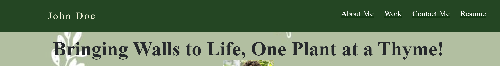

# Professional-Portfolio

Description
The Professional Portfolio was created to showcase the skills learned in module 2, such as flexbox, media queries, and CSS variables. This knowledge was used to create a fictitious portfolio so that an employer could potential view an employee's deployed portfolio. The protfolio includes a section about the potential employee, some of their work samples, and a way to contact them. 

The portfolio was created using various HTML and CSS elements, making it simple to navigate. The banner at the top of the portfolio contains a nav bar that is directly linked to the various sections of the profile. Each section was created using two divs and a split. The right compartment is the title of the section, such as About Me, Works, Contact me or Resume. While the left compartment is the corresponding information/data. 

Credits
This assignment was created by Andrew Ricker. 